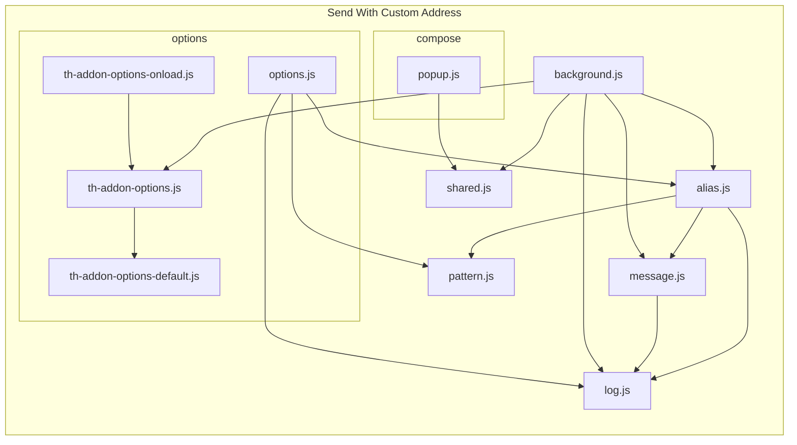

## Dependency Graph

```mermaid
flowchart LR

subgraph 0["Send With Custom Address<br>."]
1["alias.js"]
2["log.js"]
3["message.js"]
4["pattern.js"]
5["background.js"]
subgraph 6["options"]
7["th-addon-options.js"]
8["th-addon-options-default.js"]
C["options.js"]
D["th-addon-options-onload.js"]
end
9["shared.js"]
subgraph A["compose"]
B["popup.js"]
end
end
1-->2
1-->3
1-->4
3-->2
5-->1
5-->2
5-->3
5-->7
5-->9
7-->8
B-->9
C-->1
C-->2
C-->4
D-->7
```
